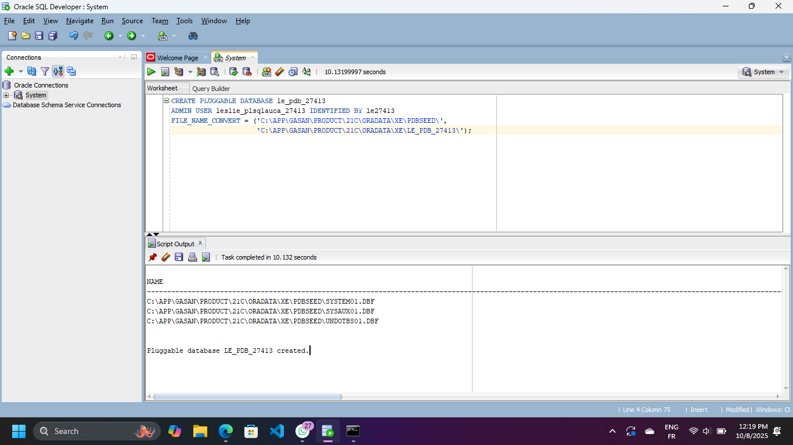
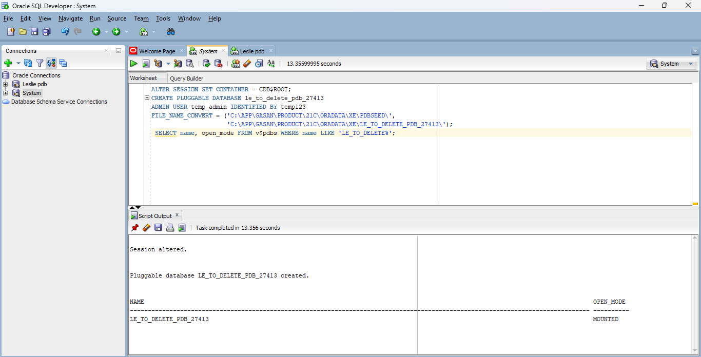
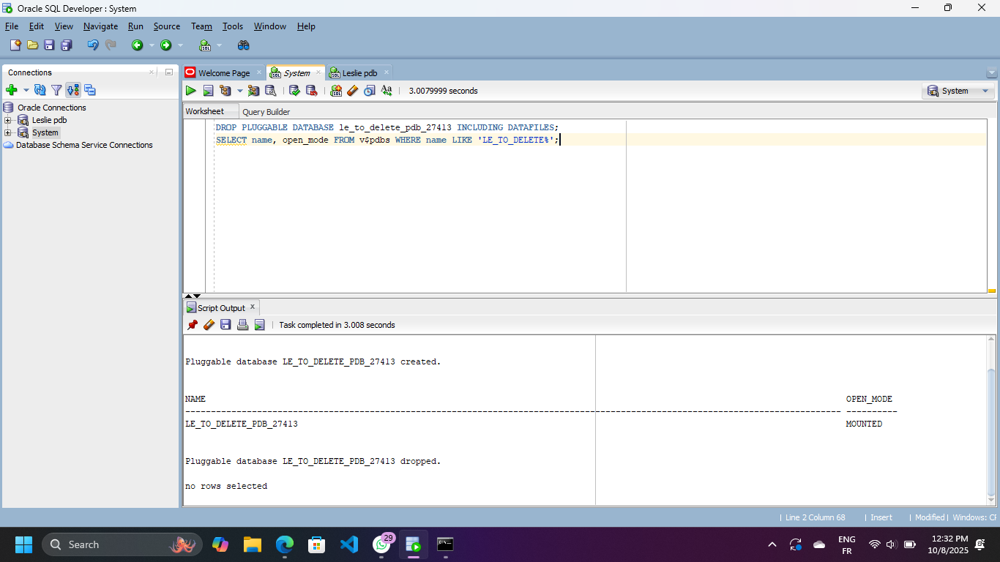
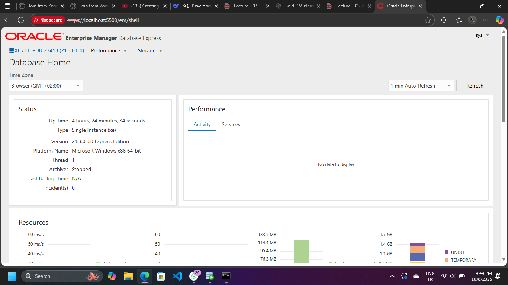

# Database Management Project Report

## Overview of Tasks

### Task 1: Create Main PDB
- Created PDB: `le_pdb_27413`
- Created user: `leslie_plsqlauca_27413`
- Status:  Completed successfully

 

### Task 2: Create and Delete Temporary PDB
- Created temporary PDB: `le_to_delete_pdb_27413`
- Successfully deleted after creation
- Status: Completed successfully

     

### Task 3: Oracle Enterprise Manager
- Configured and accessed OEM at: [https://localhost:5500/em](https://localhost:5500/em)
- Status:  Completed successfully
  

---

## Issues Encountered and Solutions

### Issue 1: OEM Navigation Difficulties
**Problem:** Couldn't find Pluggable Databases view in OEM.  
**Solution:** Used SQL Developer for PDB verification and focused OEM screenshots on dashboard with username visibility.

### Issue 2: File Path Errors
**Problem:** Complex file paths in PDB creation.  
**Solution:** Used simplified PDB creation syntax without file paths.

---

## Technical Environment

- **Database:** Oracle 21c Express Edition  
- **Host:** localhost:1521  
- **Container:** XE  
- **Tools Used:** SQL Developer,  Oracle Enterprise Manager

---

## Conclusion

All assignment requirements completed successfully.  
Main PDB `le_pdb_27413` is operational and ready for class work.  
Temporary PDB properly managed with create/delete cycle.  
OEM configured and accessible.
